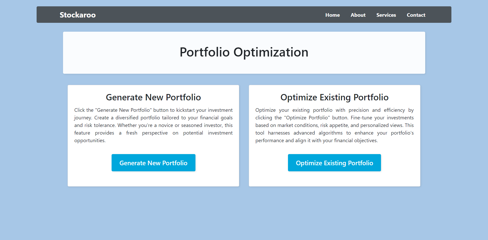
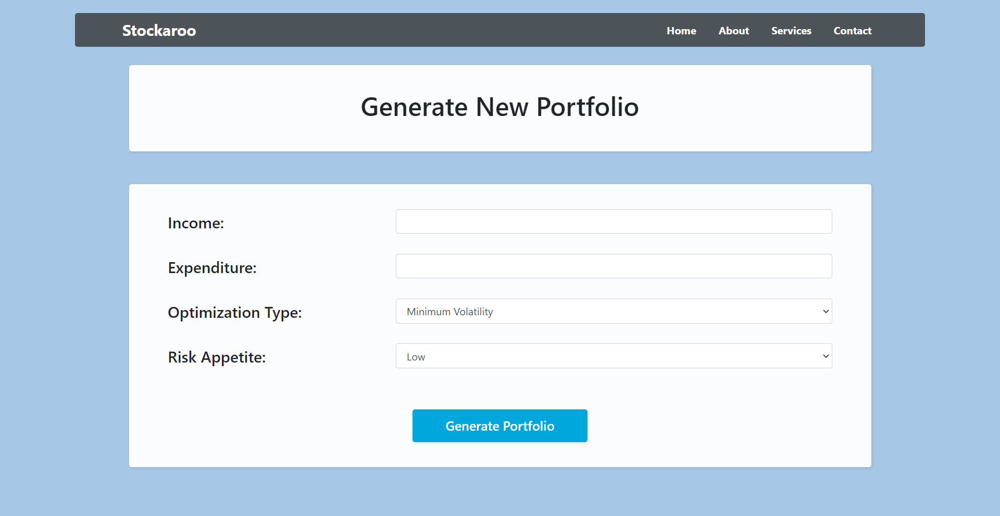
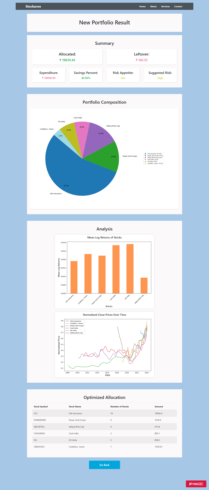
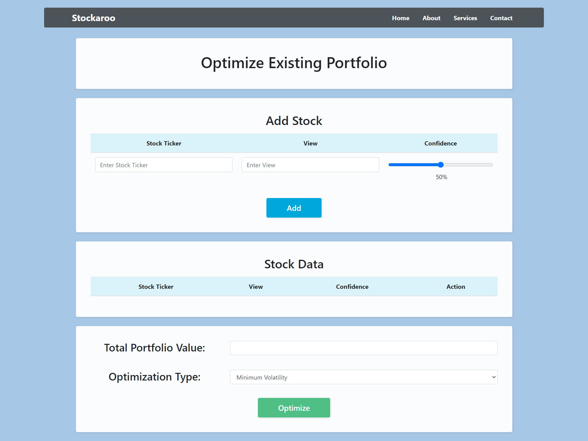
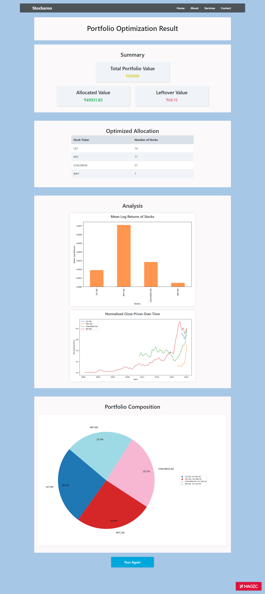
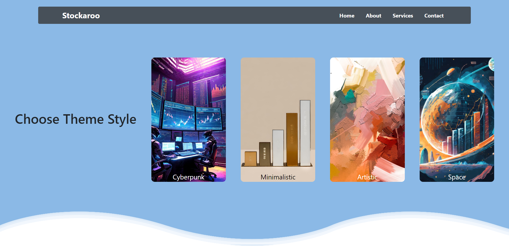

# Dynamic Investment Portfolio Optimization and Visualization with Interactive Stock Cards

This Flask-based web application is engineered to empower users in generating, optimizing, and sharing investment portfolios tailored to their financial goals and risk appetites. Leveraging financial and data analysis libraries, the platform seamlessly integrates stock data retrieval, portfolio optimization using mean-variance, Markowitz and Black-Litterman models, and interactive data visualization. The unique feature of presenting optimized portfolios as visually appealing playing cards enhances user engagement, facilitates effortless sharing, and adds a creative dimension to portfolio representation. The application's future scope aims to incorporate advanced stock prediction capabilities and a dynamic stock monitoring system, providing users with timely alerts when a stock drops below a specified threshold.

## Key Features:

### User Input and Data Retrieval:
- The Flask framework facilitates user-friendly interaction, allowing users to input parameters, add or remove stocks, and view optimized portfolio results.
- Users provide financial details and risk appetite.
- The application dynamically fetches stock data from financial screeners based on the user's risk profile.

### Portfolio Generation:
- Initial portfolio allocation is determined using either Markowitz mean-variance optimization or a risk-return optimization strategy.
- Users receive detailed insights into suggested risk levels and allocation breakdowns.

### Portfolio Optimization:
- Users can input their desired total portfolio value.
- Optimization using the Black-Litterman model incorporates user-generated views on specific stocks and confidence levels.

### Interactive Stock Cards:
- A creative and unique feature presents optimized stock results in the form of playing cards.
- Each card displays the stock's allocation, a concise one-liner explaining why the stock is considered a prudent choice, and customizable visual styles.

### Customizable Visualization:
- Users can tailor the appearance of the playing cards, adding a personal touch to the representation of their investment portfolio.

### Dynamic Plotting:
- The application generates dynamic and informative plots, including pie charts illustrating portfolio allocations and legends for detailed asset information.
- Additional plots depict mean log returns and normalized prices over time for the selected assets.

### Future Scope: Stock Prediction and Monitoring:
- The application aims to incorporate advanced stock prediction models to provide users with insights into potential future stock performance.
- Predictive analytics will enhance decision-making by offering forecasts based on historical data and market trends.

### Ease of Sharing:
- The playing card format enhances the shareability of optimized portfolios, providing an engaging and visually appealing representation for easy communication.

### Persistence:
- The code is designed to be extensible, allowing for future enhancements and modifications to accommodate new features or improvements.

This comprehensive and innovative web application not only serves as a versatile tool for current portfolio optimization but also envisions a future where users can benefit from predictive analytics for informed investment decisions. The integration of stock prediction will further solidify its position as a holistic solution for individual investors.
